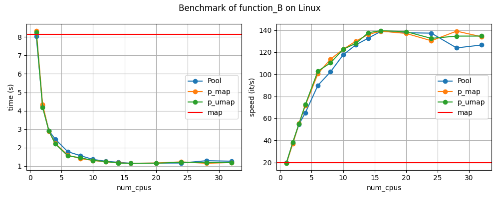
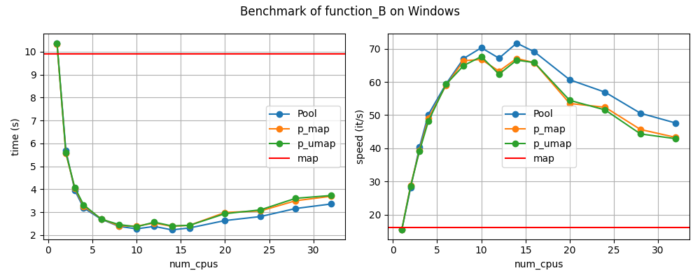

# benchmark-multiprocessing

Comparison of different processing methods and the effect of the number of cpus.

## Installation

Clone the repository and run inside the folder :

```{bash}
poetry install
```

## Example

Run :

```{bash}
python example.py
```



